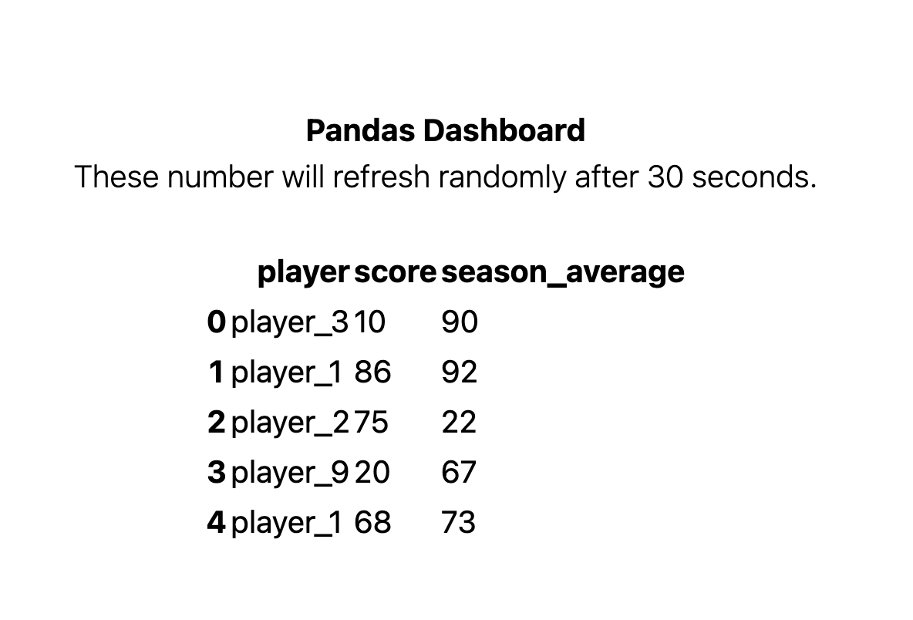

# pandas-dashboard

This is a simple web ui dashboard for a pandas dataframe. The data is randomly generated every 15 minutes and stored a redis cache. The front-end of the app uses flask to fetch the data from  redis and visualize it.

### Requirements

- Docker for Desktop


### Starting the Application

The entire solution is dockerized. Run the following Makefile command to run the solution via docker compose or locally. The following make command to uses docker-compose start the container orchestration.

```bash
# Start the docker container using a make command.
make startup
```

After running docker compose you should be able to access the application at http://localhost:8000/ with docker compose.

If you want to run fastapi locally. The uvicorn command in the .app/Makefile is set to use localhost:8080/




### Architecture

